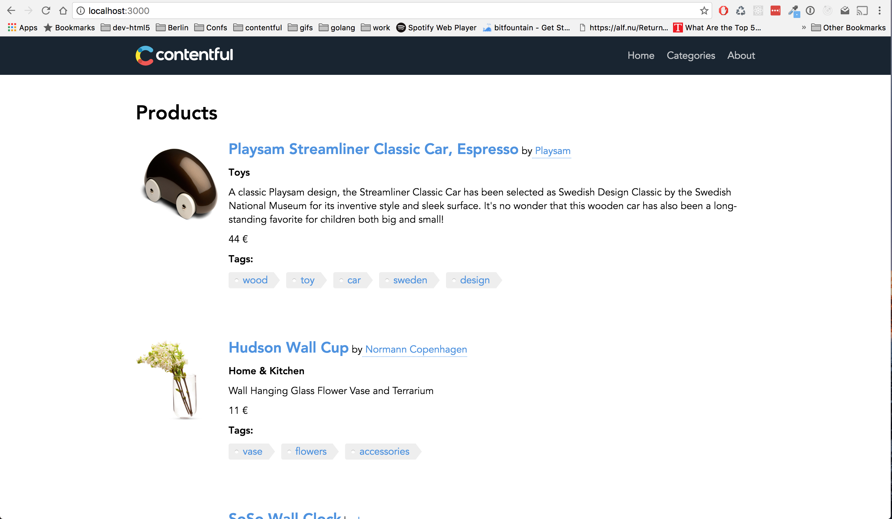
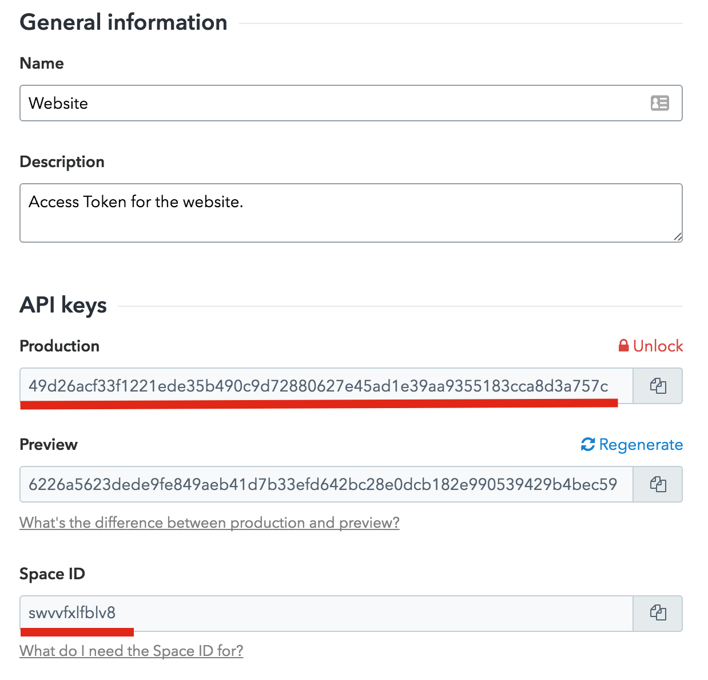

This guide will walk you through your first steps using Contentful within an Express Node js application. It will provide a step-by-step guide on how to get your first entries and start using the content you create on Contentful.

## Requirements

- A [Heroku][1] account
- [Heroku CLI][14] installed
- [Node.js] [2] 6.2.1 installed 
- Npm 3.10.7 which should be installed with Nodejs
- [Git][12] installed
- Basic Command Line Interface knowledge

## Start from a demo application

First we'll start with a [demo project][3], which is a simple Express js application using Contentful's 'Product Catalogue' template, so that you can see it running for yourself.

Run the following commands to get started.

- Clone the example repository:

~~~bash
git clone https://github.com/contentful/contentful_express_tutorial.git
~~~

- Navigate into the repository's directory:

~~~bash
$ cd contentful_express_tutorial
~~~

- Install dependencies:

~~~bash
$ npm install
~~~

- Run the server:

~~~bash
$ npm run dev
~~~

Everything is now set up. You can view your new data by opening [_http://localhost:3000/_][4] in your browser.

It should look something like this:

### Using your own content

You can create your own custom data by following these steps:

- Create an account with [Contentful][6] or [Log In][5].
- Create a new Space with the 'Product Catalogue' template, name it whatever you like.
- Copy the space Id and api key as shown in the screenshot

- In the Express js application:
  - navigate to the package.json file open it and change the values `accessToken` and `space` in the `config` section and save.
  - run `npm run dev` to start the server
  - Your space will be now displayed in your application

Next in the _[Contentful web app][6] > Content_:

- Open the product called 'Playsam Streamliner Classic Car, Espresso'.
- Change the value of the _Product name_ field to a new value,
- Click the _Publish changes_ button
- Wait a few seconds for the changes to propagate to the CDN.
- Reload your Express js application and you will see the new product name.

You can continue to edit your content inside the [Contentful web app][13] and see the content change inside your application.

### Deploy the demo to Heroku

To view the demo application live in your own production environment, follow these steps:

- Having Heroku CLI Installed, Login to Heroku if you're not logged in already:

~~~bash
heroku login
~~~

- Create a new instance:

~~~bash
heroku create
~~~

- Commit your change:

~~~bash
git add .
git commit -m "Add Website"
~~~

- Deploy to Heroku:

~~~bash
git push heroku master
~~~

- Open the application in your browser:

~~~bash
heroku open
~~~

## Next Steps

After this guide, you should be able to start using Contentful with your Express js applications, but every project has different needs and we want to provide you with the best solutions we can.

You can read about the Contentful CDA library in more detail on our [contentful.js GitHub][1] or our [Getting Started with CDA SDK tutorial][9]. We also suggest taking a look at our [Product Example Application][10].

Do you like building static sites? Check how to build static sites using Contentful with [Metalsmith][11] 

[1]: https://heroku.com
[2]: https://nodejs.org
[3]: https://github.com/contentful/contentful_express_tutorial
[4]: http://localhost:3000
[5]: https://www.contentful.com/sign-up/#starter
[6]: https://app.contentful.com
[7]: /developers/docs/references/content-delivery-api/#/reference/search-parameters
[8]: https://github.com/contentful/contentful.js
[9]: https://www.contentful.com/developers/docs/javascript/tutorials/using-js-cda-sdk/
[10]: https://github.com/contentful/product-catalogue-js
[11]: https://github.com/contentful-labs/contentful-metalsmith-example
[12]: https://git-scm.com/downloads
[14]: https://devcenter.heroku.com/articles/heroku-command-line#download-and-install
